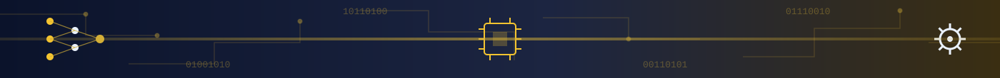

 

 

##  About

**آذرین افزار** یک مجموعه فناوری در تقاطع **هوش مصنوعی، مهندسی نرم‌افزار و داده** است.

ما بر طراحی و توسعه سیستم‌های هوشمند و محصولات نرم‌افزاری تمرکز داریم؛ از پژوهش و آزمایش یک ایده تا تبدیل آن به یک سیستم مهندسی‌شده، قابل توسعه و قابل استفاده در دنیای واقعی.

 ➜
 ➜

 

##  Capabilities

<table width="100%">
<tr>
<td width="50%" valign="top">

###  Artificial Intelligence

یادگیری ماشین، یادگیری عمیق، هوش مصنوعی مولد، پردازش زبان طبیعی و سیستم‌های هوشمند.

</td>
<td width="50%" valign="top">

###  Computer Vision

پردازش تصویر، تشخیص و طبقه‌بندی، تحلیل داده‌های بصری و پردازش تصاویر پزشکی.

</td>
</tr>
<tr>
<td width="50%" valign="top">

###  Software Engineering

معماری نرم‌افزار، توسعه Backend، طراحی API، سامانه‌های مقیاس‌پذیر و یکپارچه‌سازی سیستم‌ها.

</td>
<td width="50%" valign="top">

###  Data & Intelligence

پردازش و تحلیل داده، داده‌کاوی، مدل‌سازی، پیش‌بینی و سیستم‌های تصمیم‌یار.

</td>
</tr>
<tr>
<td colspan="2" valign="top">

###  Research & Development

پژوهش کاربردی، توسعه الگوریتم، نمونه‌سازی، ارزیابی فناوری و بررسی فناوری‌های نوظهور.

</td>
</tr>
</table>

 

##  Technology

**Languages**
 

  

**AI / ML**
 

  

**Data**
 

  

**Infrastructure**
 

 

## 🔬 Research & Development

➜➜➜➜

تحقیق و توسعه در آذرین افزار با هدف تبدیل دانش و ایده‌های فناورانه به راهکارهای قابل استفاده انجام می‌شود.

فرآیند توسعه از شناخت مسئله آغاز می‌شود، سپس ایده در محیط آزمایشی بررسی شده و در صورت اثبات قابلیت، به نمونه اولیه و در نهایت یک سیستم مهندسی‌شده تبدیل می‌شود.

 

##  Selected Work

| Area | Description | Stack |
|---|---|---|
| **Intelligent Systems** | 
سامانه‌های هوشمند مبتنی بر یادگیری ماشین برای مسائل پیچیده و کاربردهای واقعی.
 | `Python` `PyTorch` `FastAPI` |
| **Computer Vision** | 
سیستم‌های پردازش تصویر، بینایی ماشین و تحلیل داده‌های بصری.
 | `Python` `PyTorch` `OpenCV` |
| **Medical AI** | 
تحقیق و توسعه راهکارهای هوشمند برای تحلیل تصاویر و داده‌های پزشکی.
 | `Deep Learning` `CV` `R&D` |
| **Data Systems** | 
مدل‌سازی، تحلیل، پیش‌بینی و سیستم‌های تصمیم‌یار داده‌محور.
 | `Python` `NumPy` `Pandas` |
| **Software Platforms** | 
طراحی و توسعه محصولات نرم‌افزاری، APIها و سامانه‌های مقیاس‌پذیر.
 | `TypeScript` `FastAPI` `Docker` |

 

##  Engineering Philosophy

|  Research |  Engineering |  Innovation |
|:---:|:---:|:---:|
| Understand the problem | Build reliable systems | Create useful technology |

 

## Collaboration

آذرین افزار از همکاری در پروژه‌های تحقیقاتی، صنعتی و فناورانه در زمینه هوش مصنوعی، مهندسی نرم‌افزار، داده و توسعه فناوری استقبال می‌کند.

 

